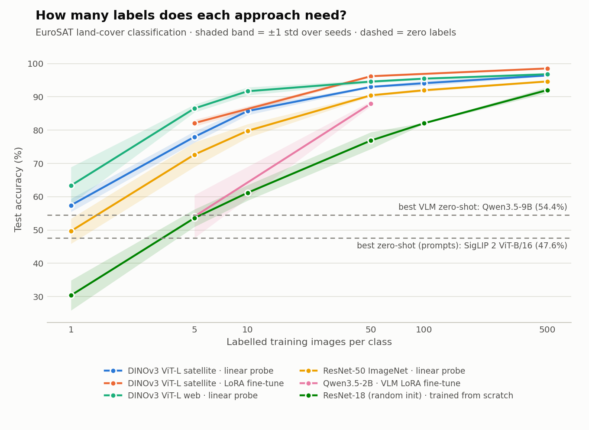

# Label-Efficient Satellite Image Classification with Vision Foundation Models

[](https://github.com/kingmars2022/eurosat-foundation-models/actions/workflows/tests.yml)

**How many labelled satellite images do you really need?** This project compares five groups of
computer-vision methods on [EuroSAT](https://github.com/phelber/EuroSAT) land-cover classification
(Sentinel-2, 10 classes) under tight labelling budgets of **0 to 500 images per class**:

| Generation | Approach | Models |
|---|---|---|
| Classic deep learning | CNN trained from scratch | ResNet-18 |
| Transfer learning (2015) | frozen ImageNet features + linear probe | ResNet-50 |
| Vision foundation models (2025) | frozen features + linear probe, LoRA fine-tuning | **DINOv3 ViT-L trained on 493M satellite tiles**, DINOv3 web-trained ViT-B/L |
| Image-text models | zero-shot from text prompts, linear probe | CLIP, SigLIP 2, RemoteCLIP |
| Multimodal LLMs (2026) | zero-shot and in-context prompting, LoRA fine-tuning | **Qwen3.5** 0.8B / 2B / 4B / 9B, Gemma 3 4B *(planned)* |

Everything runs on a **free Kaggle or Colab GPU**. Items marked *(planned)* are implemented and pass the
smoke test but are not in the results yet (see [Not yet run](#not-yet-run)).

## Why this matters

Turning satellite images into land-cover maps still needs labelled examples, and labelling takes time.
The questions this project asks:

1. **Does domain-specific pre-training pay off?** DINOv3 has a web-trained and a satellite-trained ViT-L
   with identical architecture, which gives a controlled comparison.
2. **Can a general-purpose multimodal LLM replace a specialised model?** A chat VLM needs no training at all,
   but is it accurate enough, and what does it cost per image compared with a frozen encoder plus a linear layer?
3. **How far do a handful of labels go?** Where does each method's learning curve saturate?

## Results

170 runs, all on free Tesla T4 GPUs (Google Colab and Kaggle notebooks). Test set: 2,000 images (fixed, stratified, 200 per class).
Every number in this section is taken directly from the per-run log written by the pipeline ([`results/runs.csv`](results/runs.csv))
and summarised with `python -m eurofm.report`.

<picture>
  <source media="(prefers-color-scheme: dark)" srcset="results/figures/learning_curves_dark.png">
  
</picture>

### Accuracy (%)

Mean ± std over 3 seeds. Columns = labelled images per class (0 = zero-shot, all = full training pool).
Zero-shot rows and the `all` column are a single run, so they have no std.

| Model | Method | 0 | 1 | 5 | 10 | 50 | 100 | 500 | all |
|---|---|---:|---:|---:|---:|---:|---:|---:|---:|
| ResNet-18 (random init) | trained from scratch |  | 30.4 ± 4.5 | 53.6 ± 2.6 | 61.2 ± 2.3 | 76.9 ± 2.5 | 82.1 ± 0.2 | 92.0 ± 0.9 |  |
| CLIP ViT-B/16 | zero-shot (prompts) | 36.7 |  |  |  |  |  |  |  |
| RemoteCLIP ViT-B/32 | zero-shot (prompts) | 37.7 |  |  |  |  |  |  |  |
| SigLIP 2 ViT-B/16 | zero-shot (prompts) | 47.6 |  |  |  |  |  |  |  |
| CLIP ViT-B/16 | linear probe |  | 44.0 ± 8.1 | 70.5 ± 1.0 | 75.9 ± 2.1 | 87.5 ± 0.5 | 90.5 ± 0.9 | 94.0 ± 0.2 |  |
| DINOv3 ViT-B web | linear probe |  | 59.8 ± 2.1 | 84.3 ± 0.4 | 88.6 ± 0.3 | 93.3 ± 0.6 | 94.4 ± 0.3 | 96.2 ± 0.2 |  |
| DINOv3 ViT-L satellite | linear probe |  | 57.4 ± 2.0 | 78.0 ± 1.7 | 85.7 ± 1.2 | 93.0 ± 0.3 | 94.1 ± 0.8 | 96.4 ± 0.2 | 97.5 |
| DINOv3 ViT-L web | linear probe |  | 63.4 ± 5.6 | 86.5 ± 1.2 | 91.7 ± 1.2 | 94.6 ± 0.5 | 95.5 ± 0.4 | 96.8 ± 0.3 |  |
| RemoteCLIP ViT-B/32 | linear probe |  | 60.7 ± 6.4 | 80.0 ± 1.8 | 86.3 ± 1.5 | 91.3 ± 0.1 | 92.8 ± 0.4 | 94.9 ± 0.3 |  |
| ResNet-50 ImageNet | linear probe |  | 49.7 ± 3.8 | 72.7 ± 3.7 | 79.8 ± 2.0 | 90.5 ± 0.4 | 92.0 ± 0.4 | 94.6 ± 0.2 |  |
| SigLIP 2 ViT-B/16 | linear probe |  | 52.3 ± 8.3 | 79.7 ± 0.8 | 84.6 ± 0.7 | 91.2 ± 0.8 | 92.9 ± 0.1 | 95.4 ± 0.3 |  |
| DINOv3 ViT-L satellite | LoRA fine-tune |  |  | 82.1 ± 1.0 |  | 96.2 ± 0.3 |  | 98.5 ± 0.1 |  |
| Qwen3.5-0.8B | VLM zero-shot | 12.7 |  |  |  |  |  |  |  |
| Qwen3.5-2B | VLM zero-shot | 46.4 |  |  |  |  |  |  |  |
| Qwen3.5-4B | VLM zero-shot | 53.9 |  |  |  |  |  |  |  |
| Qwen3.5-9B | VLM zero-shot | 54.4 |  |  |  |  |  |  |  |
| Qwen3.5-4B | VLM in-context few-shot |  | 55.7 ± 2.6 |  |  |  |  |  |  |
| Qwen3.5-2B | VLM LoRA fine-tune |  |  | 54.0 ± 6.5 |  | 88.0 ± 0.8 |  |  |  |

### Macro-F1 (%)

Same runs, same layout.

| Model | Method | 0 | 1 | 5 | 10 | 50 | 100 | 500 | all |
|---|---|---:|---:|---:|---:|---:|---:|---:|---:|
| ResNet-18 (random init) | trained from scratch |  | 30.0 ± 5.1 | 52.8 ± 1.9 | 60.4 ± 2.4 | 76.5 ± 2.4 | 81.9 ± 0.1 | 92.0 ± 0.9 |  |
| CLIP ViT-B/16 | zero-shot (prompts) | 34.7 |  |  |  |  |  |  |  |
| RemoteCLIP ViT-B/32 | zero-shot (prompts) | 34.9 |  |  |  |  |  |  |  |
| SigLIP 2 ViT-B/16 | zero-shot (prompts) | 42.0 |  |  |  |  |  |  |  |
| CLIP ViT-B/16 | linear probe |  | 42.6 ± 9.5 | 69.8 ± 0.7 | 75.8 ± 1.9 | 87.4 ± 0.5 | 90.5 ± 0.8 | 94.0 ± 0.2 |  |
| DINOv3 ViT-B web | linear probe |  | 59.1 ± 2.3 | 84.0 ± 0.3 | 88.5 ± 0.3 | 93.3 ± 0.6 | 94.4 ± 0.3 | 96.2 ± 0.2 |  |
| DINOv3 ViT-L satellite | linear probe |  | 56.6 ± 2.8 | 77.7 ± 1.7 | 85.6 ± 1.2 | 93.0 ± 0.3 | 94.1 ± 0.8 | 96.4 ± 0.2 | 97.5 |
| DINOv3 ViT-L web | linear probe |  | 61.5 ± 6.2 | 86.6 ± 1.3 | 91.7 ± 1.2 | 94.6 ± 0.4 | 95.5 ± 0.4 | 96.8 ± 0.3 |  |
| RemoteCLIP ViT-B/32 | linear probe |  | 59.1 ± 7.6 | 79.7 ± 2.2 | 86.2 ± 1.5 | 91.3 ± 0.1 | 92.8 ± 0.4 | 94.9 ± 0.3 |  |
| ResNet-50 ImageNet | linear probe |  | 46.8 ± 5.9 | 71.2 ± 4.6 | 79.2 ± 2.3 | 90.5 ± 0.4 | 92.0 ± 0.4 | 94.6 ± 0.2 |  |
| SigLIP 2 ViT-B/16 | linear probe |  | 50.4 ± 9.3 | 79.5 ± 0.5 | 84.6 ± 0.6 | 91.2 ± 0.8 | 92.9 ± 0.1 | 95.4 ± 0.3 |  |
| DINOv3 ViT-L satellite | LoRA fine-tune |  |  | 81.8 ± 1.2 |  | 96.2 ± 0.3 |  | 98.5 ± 0.1 |  |
| Qwen3.5-0.8B | VLM zero-shot | 6.1 |  |  |  |  |  |  |  |
| Qwen3.5-2B | VLM zero-shot | 41.8 |  |  |  |  |  |  |  |
| Qwen3.5-4B | VLM zero-shot | 49.5 |  |  |  |  |  |  |  |
| Qwen3.5-9B | VLM zero-shot | 52.0 |  |  |  |  |  |  |  |
| Qwen3.5-4B | VLM in-context few-shot |  | 50.8 ± 3.3 |  |  |  |  |  |  |
| Qwen3.5-2B | VLM LoRA fine-tune |  |  | 48.6 ± 7.1 |  | 88.0 ± 0.7 |  |  |  |

### Cost

Largest budget per row (mean train time over seeds). For the DINOv3 ViT-L satellite linear probe that is the
`all` budget (25,000 images), which is why its train time is higher than the other probes (500 per class).
Latency is batch inference on a Tesla T4.

| Model | Method | Total params | Trainable params | Train time (s) | Inference (ms/img) | VLM parse rate |
|---|---|---:|---:|---:|---:|---:|
| ResNet-18 (random init) | trained from scratch | 11.2M | 11.2M | 54 | 0.05 |  |
| CLIP ViT-B/16 | zero-shot (prompts) | 149.6M | 0 | 0 | 2.80 |  |
| RemoteCLIP ViT-B/32 | zero-shot (prompts) | 151.3M | 0 | 0 | 0.78 |  |
| SigLIP 2 ViT-B/16 | zero-shot (prompts) | 375.2M | 0 | 0 | 2.44 |  |
| CLIP ViT-B/16 | linear probe | 149.6M | 5.1K | 22 | 2.80 |  |
| DINOv3 ViT-B web | linear probe | 85.6M | 7.7K | 16 | 3.23 |  |
| DINOv3 ViT-L satellite | linear probe | 303.1M | 10.2K | 152 | 9.96 |  |
| DINOv3 ViT-L web | linear probe | 303.1M | 10.2K | 23 | 10.00 |  |
| RemoteCLIP ViT-B/32 | linear probe | 151.3M | 5.1K | 15 | 0.78 |  |
| ResNet-50 ImageNet | linear probe | 23.5M | 20.5K | 45 | 1.03 |  |
| SigLIP 2 ViT-B/16 | linear probe | 375.2M | 7.7K | 25 | 2.44 |  |
| DINOv3 ViT-L satellite | LoRA fine-tune | 305.4M | 2.4M | 744 | 11.55 |  |
| Qwen3.5-0.8B | VLM zero-shot | 853.0M | 0 | 0 | 67.94 | 100.0% |
| Qwen3.5-2B | VLM zero-shot | 2.2B | 0 | 0 | 107.73 | 100.0% |
| Qwen3.5-4B | VLM zero-shot | 4.5B | 0 | 0 | 219.57 | 100.0% |
| Qwen3.5-9B | VLM zero-shot | 5.7B\* | 0 | 0 | 360.36 | 100.0% |
| Qwen3.5-4B | VLM in-context few-shot | 4.5B | 0 | 0 | 1089.63 | 100.0% |
| Qwen3.5-2B | VLM LoRA fine-tune | 2.2B | 16.8M | 341 | 133.51 | 100.0% |

\* Qwen3.5-9B was loaded in 4-bit, which packs the weights, so the counted number (5.7B) is lower than the
model's nominal ~9B parameters.

### Key findings

1. **10 labels per class on a frozen encoder ≈ 500 per class from scratch.** With 10 labels per class, a frozen DINOv3 ViT-L (web)
   plus a linear layer reaches 91.7%, about what a ResNet-18 trained from scratch reaches with 500 per class (92.0%).
   At 10 labels per class the from-scratch model is at 61.2%.
2. **Satellite pre-training did not beat web pre-training here.** DINOv3 ViT-L trained on 493M satellite tiles
   is below the web-trained ViT-L with identical architecture at every budget (57.4% vs 63.4% at 1-shot,
   96.4% vs 96.8% at 500-shot). A likely reason is a domain gap inside "satellite": SAT-493M is very-high-resolution
   imagery, while EuroSAT is 10 m/px Sentinel-2 upsampled from 64 px. This is a hypothesis, not tested here.
3. **Domain adaptation does help the CLIP family.** RemoteCLIP (CLIP tuned on remote-sensing captions) beats
   OpenAI CLIP under the same linear probe at every budget, most at 1-shot (60.7% vs 44.0%). The backbones
   are not identical (RemoteCLIP is ViT-B/32, CLIP is ViT-B/16). In zero-shot the gap is small (37.7% vs 36.7%).
4. **Chat VLMs are not a substitute for a small labelled set.** The best zero-shot VLM, Qwen3.5-9B (54.4%),
   is below a 1-shot linear probe on DINOv3 ViT-L web (63.4%) and is about 36x slower per image (360 vs 10 ms;
   the two latencies come from different scripts and batch sizes, so treat the ratio as rough).
   One in-context example per class (10 images in the prompt) lifts Qwen3.5-4B only from 53.9% to 55.7%. Qwen3.5-0.8B collapses (12.7%):
   it answers "Forest", the example word in the prompt, for 80% of test images.
5. **LoRA fine-tuning beats the frozen linear probe at every budget, with under 1% of the weights trained.**
   On DINOv3 ViT-L satellite, LoRA (2.4M trainable parameters, 0.8% of the model) reaches 82.1% / 96.2% / 98.5%
   at 5 / 50 / 500 labels per class, against 78.0% / 93.0% / 96.4% for the linear probe. With 500 per class
   (5,000 images) it beats the linear probe trained on the whole 25,000-image pool (97.5%), and 98.5% is the best
   result in this project. At 5 labels per class the frozen web DINOv3 linear probe (86.5%) is still ahead.
6. **Fine-tuning a VLM helps a lot, but it still trails a vision encoder.** LoRA on Qwen3.5-2B lifts it from
   46.4% zero-shot to 54.0% with 5 labels per class and 88.0% with 50. At 50 per class that is still below the
   DINOv3 satellite linear probe (93.0%) and LoRA (96.2%), with 7x more trainable parameters (16.8M vs 2.4M)
   and about 12x the latency per image (134 vs 12 ms). With 5 labels per class it is unstable across seeds (± 6.5).

### Not yet run

- Gemma 3 4B zero-shot (optional line in notebook Stage C). It is implemented and passes the smoke test
  but is not in these results yet.
- LoRA fine-tuning of the web-trained DINOv3 ViT-L, which would show whether the satellite-vs-web gap in
  finding 2 survives fine-tuning.

[`notebooks/run_missing.ipynb`](notebooks/run_missing.ipynb) runs only what is missing, skipping everything already in `results/runs.csv`
([open in Colab](https://colab.research.google.com/github/kingmars2022/eurosat-foundation-models/blob/main/notebooks/run_missing.ipynb)).

<details>
<summary><b>All 170 individual runs</b> (click to expand)</summary>

| Method | Model | k | Seed | Accuracy | Macro-F1 | Trainable params | Train (s) | ms/img |
|---|---|---:|---:|---:|---:|---:|---:|---:|
| trained from scratch | ResNet-18 (random init) | 1 | 0 | 26.55 | 24.67 | 11,181,642 | 10.2 | 0.09 |
| trained from scratch | ResNet-18 (random init) | 1 | 1 | 29.20 | 30.54 | 11,181,642 | 9.1 | 0.04 |
| trained from scratch | ResNet-18 (random init) | 1 | 2 | 35.35 | 34.80 | 11,181,642 | 8.6 | 0.04 |
| trained from scratch | ResNet-18 (random init) | 5 | 0 | 50.55 | 51.09 | 11,181,642 | 9.4 | 0.04 |
| trained from scratch | ResNet-18 (random init) | 5 | 1 | 54.95 | 52.46 | 11,181,642 | 8.9 | 0.04 |
| trained from scratch | ResNet-18 (random init) | 5 | 2 | 55.25 | 54.78 | 11,181,642 | 9.2 | 0.04 |
| trained from scratch | ResNet-18 (random init) | 10 | 0 | 58.60 | 57.63 | 11,181,642 | 9.3 | 0.04 |
| trained from scratch | ResNet-18 (random init) | 10 | 1 | 63.15 | 62.29 | 11,181,642 | 9.3 | 0.04 |
| trained from scratch | ResNet-18 (random init) | 10 | 2 | 61.80 | 61.27 | 11,181,642 | 9.1 | 0.04 |
| trained from scratch | ResNet-18 (random init) | 50 | 0 | 77.70 | 77.23 | 11,181,642 | 14.4 | 0.04 |
| trained from scratch | ResNet-18 (random init) | 50 | 1 | 78.90 | 78.49 | 11,181,642 | 14.4 | 0.04 |
| trained from scratch | ResNet-18 (random init) | 50 | 2 | 74.05 | 73.84 | 11,181,642 | 14.4 | 0.04 |
| trained from scratch | ResNet-18 (random init) | 100 | 0 | 82.00 | 81.90 | 11,181,642 | 29.2 | 0.04 |
| trained from scratch | ResNet-18 (random init) | 100 | 1 | 82.30 | 82.10 | 11,181,642 | 28.6 | 0.04 |
| trained from scratch | ResNet-18 (random init) | 100 | 2 | 81.90 | 81.82 | 11,181,642 | 28.8 | 0.04 |
| trained from scratch | ResNet-18 (random init) | 500 | 0 | 93.05 | 93.05 | 11,181,642 | 54.0 | 0.04 |
| trained from scratch | ResNet-18 (random init) | 500 | 1 | 91.40 | 91.35 | 11,181,642 | 53.9 | 0.05 |
| trained from scratch | ResNet-18 (random init) | 500 | 2 | 91.70 | 91.70 | 11,181,642 | 53.9 | 0.05 |
| zero-shot (prompts) | CLIP ViT-B/16 | 0 | 0 | 36.70 | 34.74 | 0 | 0.0 | 2.80 |
| zero-shot (prompts) | RemoteCLIP ViT-B/32 | 0 | 0 | 37.70 | 34.90 | 0 | 0.0 | 0.78 |
| zero-shot (prompts) | SigLIP 2 ViT-B/16 | 0 | 0 | 47.65 | 42.01 | 0 | 0.0 | 2.44 |
| linear probe | CLIP ViT-B/16 | 1 | 0 | 51.20 | 51.50 | 5,130 | 0.0 | 2.80 |
| linear probe | CLIP ViT-B/16 | 1 | 1 | 35.25 | 32.63 | 5,130 | 0.0 | 2.80 |
| linear probe | CLIP ViT-B/16 | 1 | 2 | 45.65 | 43.69 | 5,130 | 0.0 | 2.80 |
| linear probe | CLIP ViT-B/16 | 5 | 0 | 70.50 | 70.41 | 5,130 | 0.5 | 2.80 |
| linear probe | CLIP ViT-B/16 | 5 | 1 | 71.45 | 69.96 | 5,130 | 0.5 | 2.80 |
| linear probe | CLIP ViT-B/16 | 5 | 2 | 69.45 | 69.10 | 5,130 | 0.5 | 2.80 |
| linear probe | CLIP ViT-B/16 | 10 | 0 | 74.05 | 73.93 | 5,130 | 0.6 | 2.80 |
| linear probe | CLIP ViT-B/16 | 10 | 1 | 78.20 | 77.81 | 5,130 | 0.7 | 2.80 |
| linear probe | CLIP ViT-B/16 | 10 | 2 | 75.50 | 75.57 | 5,130 | 0.6 | 2.80 |
| linear probe | CLIP ViT-B/16 | 50 | 0 | 87.40 | 87.37 | 5,130 | 2.0 | 2.80 |
| linear probe | CLIP ViT-B/16 | 50 | 1 | 88.05 | 87.98 | 5,130 | 1.9 | 2.80 |
| linear probe | CLIP ViT-B/16 | 50 | 2 | 87.00 | 87.00 | 5,130 | 2.2 | 2.80 |
| linear probe | CLIP ViT-B/16 | 100 | 0 | 90.20 | 90.19 | 5,130 | 5.0 | 2.80 |
| linear probe | CLIP ViT-B/16 | 100 | 1 | 91.50 | 91.50 | 5,130 | 3.5 | 2.80 |
| linear probe | CLIP ViT-B/16 | 100 | 2 | 89.90 | 89.92 | 5,130 | 3.3 | 2.80 |
| linear probe | CLIP ViT-B/16 | 500 | 0 | 94.20 | 94.21 | 5,130 | 22.2 | 2.80 |
| linear probe | CLIP ViT-B/16 | 500 | 1 | 93.75 | 93.76 | 5,130 | 21.2 | 2.80 |
| linear probe | CLIP ViT-B/16 | 500 | 2 | 93.95 | 93.95 | 5,130 | 22.0 | 2.80 |
| linear probe | DINOv3 ViT-B web | 1 | 0 | 58.25 | 59.82 | 7,690 | 0.0 | 3.23 |
| linear probe | DINOv3 ViT-B web | 1 | 1 | 58.90 | 56.57 | 7,690 | 0.1 | 3.23 |
| linear probe | DINOv3 ViT-B web | 1 | 2 | 62.25 | 60.96 | 7,690 | 0.1 | 3.23 |
| linear probe | DINOv3 ViT-B web | 5 | 0 | 84.70 | 84.39 | 7,690 | 0.8 | 3.23 |
| linear probe | DINOv3 ViT-B web | 5 | 1 | 83.95 | 83.72 | 7,690 | 0.6 | 3.23 |
| linear probe | DINOv3 ViT-B web | 5 | 2 | 84.15 | 84.03 | 7,690 | 0.5 | 3.23 |
| linear probe | DINOv3 ViT-B web | 10 | 0 | 88.30 | 88.23 | 7,690 | 0.6 | 3.23 |
| linear probe | DINOv3 ViT-B web | 10 | 1 | 88.60 | 88.56 | 7,690 | 0.6 | 3.23 |
| linear probe | DINOv3 ViT-B web | 10 | 2 | 88.85 | 88.84 | 7,690 | 0.6 | 3.23 |
| linear probe | DINOv3 ViT-B web | 50 | 0 | 94.05 | 94.05 | 7,690 | 1.7 | 3.23 |
| linear probe | DINOv3 ViT-B web | 50 | 1 | 93.05 | 93.06 | 7,690 | 1.4 | 3.23 |
| linear probe | DINOv3 ViT-B web | 50 | 2 | 92.85 | 92.85 | 7,690 | 1.8 | 3.23 |
| linear probe | DINOv3 ViT-B web | 100 | 0 | 94.50 | 94.50 | 7,690 | 2.6 | 3.23 |
| linear probe | DINOv3 ViT-B web | 100 | 1 | 94.65 | 94.65 | 7,690 | 4.1 | 3.23 |
| linear probe | DINOv3 ViT-B web | 100 | 2 | 94.00 | 94.00 | 7,690 | 2.7 | 3.23 |
| linear probe | DINOv3 ViT-B web | 500 | 0 | 96.25 | 96.25 | 7,690 | 15.5 | 3.23 |
| linear probe | DINOv3 ViT-B web | 500 | 1 | 96.00 | 96.00 | 7,690 | 17.2 | 3.23 |
| linear probe | DINOv3 ViT-B web | 500 | 2 | 96.35 | 96.35 | 7,690 | 15.2 | 3.23 |
| linear probe | DINOv3 ViT-L satellite | 1 | 0 | 59.60 | 59.70 | 10,250 | 0.2 | 9.96 |
| linear probe | DINOv3 ViT-L satellite | 1 | 1 | 56.95 | 55.54 | 10,250 | 0.1 | 9.96 |
| linear probe | DINOv3 ViT-L satellite | 1 | 2 | 55.75 | 54.43 | 10,250 | 0.1 | 9.96 |
| linear probe | DINOv3 ViT-L satellite | 5 | 0 | 78.70 | 78.47 | 10,250 | 1.6 | 9.96 |
| linear probe | DINOv3 ViT-L satellite | 5 | 1 | 76.05 | 75.83 | 10,250 | 2.2 | 9.96 |
| linear probe | DINOv3 ViT-L satellite | 5 | 2 | 79.15 | 78.91 | 10,250 | 0.7 | 9.96 |
| linear probe | DINOv3 ViT-L satellite | 10 | 0 | 85.35 | 85.13 | 10,250 | 1.0 | 9.96 |
| linear probe | DINOv3 ViT-L satellite | 10 | 1 | 84.75 | 84.67 | 10,250 | 0.9 | 9.96 |
| linear probe | DINOv3 ViT-L satellite | 10 | 2 | 87.10 | 87.01 | 10,250 | 0.9 | 9.96 |
| linear probe | DINOv3 ViT-L satellite | 50 | 0 | 93.10 | 93.08 | 10,250 | 2.4 | 9.96 |
| linear probe | DINOv3 ViT-L satellite | 50 | 1 | 92.70 | 92.69 | 10,250 | 2.4 | 9.96 |
| linear probe | DINOv3 ViT-L satellite | 50 | 2 | 93.20 | 93.18 | 10,250 | 4.7 | 9.96 |
| linear probe | DINOv3 ViT-L satellite | 100 | 0 | 93.35 | 93.33 | 10,250 | 4.3 | 9.96 |
| linear probe | DINOv3 ViT-L satellite | 100 | 1 | 94.05 | 94.05 | 10,250 | 4.1 | 9.96 |
| linear probe | DINOv3 ViT-L satellite | 100 | 2 | 94.90 | 94.90 | 10,250 | 6.0 | 9.96 |
| linear probe | DINOv3 ViT-L satellite | 500 | 0 | 96.25 | 96.24 | 10,250 | 29.3 | 9.96 |
| linear probe | DINOv3 ViT-L satellite | 500 | 1 | 96.35 | 96.34 | 10,250 | 26.8 | 9.96 |
| linear probe | DINOv3 ViT-L satellite | 500 | 2 | 96.70 | 96.70 | 10,250 | 25.7 | 9.96 |
| linear probe | DINOv3 ViT-L satellite | all | 0 | 97.55 | 97.55 | 10,250 | 152.3 | 9.96 |
| linear probe | DINOv3 ViT-L web | 1 | 0 | 66.15 | 65.12 | 10,250 | 0.1 | 10.00 |
| linear probe | DINOv3 ViT-L web | 1 | 1 | 56.95 | 54.30 | 10,250 | 0.1 | 10.00 |
| linear probe | DINOv3 ViT-L web | 1 | 2 | 66.95 | 64.97 | 10,250 | 0.2 | 10.00 |
| linear probe | DINOv3 ViT-L web | 5 | 0 | 86.60 | 86.67 | 10,250 | 1.9 | 10.00 |
| linear probe | DINOv3 ViT-L web | 5 | 1 | 87.65 | 87.86 | 10,250 | 1.3 | 10.00 |
| linear probe | DINOv3 ViT-L web | 5 | 2 | 85.30 | 85.22 | 10,250 | 0.6 | 10.00 |
| linear probe | DINOv3 ViT-L web | 10 | 0 | 90.30 | 90.43 | 10,250 | 1.0 | 10.00 |
| linear probe | DINOv3 ViT-L web | 10 | 1 | 92.20 | 92.22 | 10,250 | 0.8 | 10.00 |
| linear probe | DINOv3 ViT-L web | 10 | 2 | 92.55 | 92.58 | 10,250 | 1.2 | 10.00 |
| linear probe | DINOv3 ViT-L web | 50 | 0 | 95.10 | 95.10 | 10,250 | 2.2 | 10.00 |
| linear probe | DINOv3 ViT-L web | 50 | 1 | 94.40 | 94.41 | 10,250 | 1.9 | 10.00 |
| linear probe | DINOv3 ViT-L web | 50 | 2 | 94.25 | 94.27 | 10,250 | 2.0 | 10.00 |
| linear probe | DINOv3 ViT-L web | 100 | 0 | 95.40 | 95.40 | 10,250 | 5.5 | 10.00 |
| linear probe | DINOv3 ViT-L web | 100 | 1 | 95.85 | 95.86 | 10,250 | 3.4 | 10.00 |
| linear probe | DINOv3 ViT-L web | 100 | 2 | 95.15 | 95.16 | 10,250 | 3.5 | 10.00 |
| linear probe | DINOv3 ViT-L web | 500 | 0 | 96.65 | 96.65 | 10,250 | 23.9 | 10.00 |
| linear probe | DINOv3 ViT-L web | 500 | 1 | 97.20 | 97.20 | 10,250 | 24.2 | 10.00 |
| linear probe | DINOv3 ViT-L web | 500 | 2 | 96.55 | 96.56 | 10,250 | 21.3 | 10.00 |
| linear probe | RemoteCLIP ViT-B/32 | 1 | 0 | 64.60 | 64.22 | 5,130 | 0.0 | 0.78 |
| linear probe | RemoteCLIP ViT-B/32 | 1 | 1 | 53.35 | 50.40 | 5,130 | 0.1 | 0.78 |
| linear probe | RemoteCLIP ViT-B/32 | 1 | 2 | 64.20 | 62.78 | 5,130 | 0.1 | 0.78 |
| linear probe | RemoteCLIP ViT-B/32 | 5 | 0 | 77.85 | 77.24 | 5,130 | 0.6 | 0.78 |
| linear probe | RemoteCLIP ViT-B/32 | 5 | 1 | 80.85 | 80.66 | 5,130 | 0.8 | 0.78 |
| linear probe | RemoteCLIP ViT-B/32 | 5 | 2 | 81.20 | 81.24 | 5,130 | 0.7 | 0.78 |
| linear probe | RemoteCLIP ViT-B/32 | 10 | 0 | 87.25 | 87.22 | 5,130 | 0.8 | 0.78 |
| linear probe | RemoteCLIP ViT-B/32 | 10 | 1 | 87.10 | 87.00 | 5,130 | 0.6 | 0.78 |
| linear probe | RemoteCLIP ViT-B/32 | 10 | 2 | 84.50 | 84.47 | 5,130 | 0.5 | 0.78 |
| linear probe | RemoteCLIP ViT-B/32 | 50 | 0 | 91.30 | 91.28 | 5,130 | 1.7 | 0.78 |
| linear probe | RemoteCLIP ViT-B/32 | 50 | 1 | 91.20 | 91.14 | 5,130 | 1.6 | 0.78 |
| linear probe | RemoteCLIP ViT-B/32 | 50 | 2 | 91.40 | 91.39 | 5,130 | 1.4 | 0.78 |
| linear probe | RemoteCLIP ViT-B/32 | 100 | 0 | 92.35 | 92.35 | 5,130 | 2.6 | 0.78 |
| linear probe | RemoteCLIP ViT-B/32 | 100 | 1 | 92.90 | 92.87 | 5,130 | 4.0 | 0.78 |
| linear probe | RemoteCLIP ViT-B/32 | 100 | 2 | 93.15 | 93.14 | 5,130 | 2.7 | 0.78 |
| linear probe | RemoteCLIP ViT-B/32 | 500 | 0 | 94.55 | 94.55 | 5,130 | 15.4 | 0.78 |
| linear probe | RemoteCLIP ViT-B/32 | 500 | 1 | 94.95 | 94.95 | 5,130 | 15.1 | 0.78 |
| linear probe | RemoteCLIP ViT-B/32 | 500 | 2 | 95.10 | 95.09 | 5,130 | 14.2 | 0.78 |
| linear probe | ResNet-50 ImageNet | 1 | 0 | 52.75 | 52.22 | 20,490 | 0.1 | 1.03 |
| linear probe | ResNet-50 ImageNet | 1 | 1 | 45.45 | 40.51 | 20,490 | 0.1 | 1.03 |
| linear probe | ResNet-50 ImageNet | 1 | 2 | 50.80 | 47.82 | 20,490 | 0.1 | 1.03 |
| linear probe | ResNet-50 ImageNet | 5 | 0 | 75.00 | 73.79 | 20,490 | 4.0 | 1.03 |
| linear probe | ResNet-50 ImageNet | 5 | 1 | 68.40 | 65.98 | 20,490 | 1.2 | 1.03 |
| linear probe | ResNet-50 ImageNet | 5 | 2 | 74.55 | 73.97 | 20,490 | 1.3 | 1.03 |
| linear probe | ResNet-50 ImageNet | 10 | 0 | 82.05 | 81.71 | 20,490 | 1.5 | 1.03 |
| linear probe | ResNet-50 ImageNet | 10 | 1 | 79.20 | 78.69 | 20,490 | 1.5 | 1.03 |
| linear probe | ResNet-50 ImageNet | 10 | 2 | 78.10 | 77.27 | 20,490 | 1.2 | 1.03 |
| linear probe | ResNet-50 ImageNet | 50 | 0 | 90.80 | 90.81 | 20,490 | 4.3 | 1.03 |
| linear probe | ResNet-50 ImageNet | 50 | 1 | 90.10 | 90.08 | 20,490 | 4.8 | 1.03 |
| linear probe | ResNet-50 ImageNet | 50 | 2 | 90.50 | 90.48 | 20,490 | 3.6 | 1.03 |
| linear probe | ResNet-50 ImageNet | 100 | 0 | 92.10 | 92.09 | 20,490 | 8.9 | 1.03 |
| linear probe | ResNet-50 ImageNet | 100 | 1 | 91.50 | 91.50 | 20,490 | 6.9 | 1.03 |
| linear probe | ResNet-50 ImageNet | 100 | 2 | 92.35 | 92.32 | 20,490 | 8.6 | 1.03 |
| linear probe | ResNet-50 ImageNet | 500 | 0 | 94.55 | 94.54 | 20,490 | 46.5 | 1.03 |
| linear probe | ResNet-50 ImageNet | 500 | 1 | 94.90 | 94.91 | 20,490 | 42.7 | 1.03 |
| linear probe | ResNet-50 ImageNet | 500 | 2 | 94.45 | 94.46 | 20,490 | 44.3 | 1.03 |
| linear probe | SigLIP 2 ViT-B/16 | 1 | 0 | 59.70 | 59.41 | 7,690 | 0.0 | 2.44 |
| linear probe | SigLIP 2 ViT-B/16 | 1 | 1 | 54.05 | 50.80 | 7,690 | 0.0 | 2.44 |
| linear probe | SigLIP 2 ViT-B/16 | 1 | 2 | 43.30 | 40.89 | 7,690 | 0.0 | 2.44 |
| linear probe | SigLIP 2 ViT-B/16 | 5 | 0 | 79.50 | 79.55 | 7,690 | 0.6 | 2.44 |
| linear probe | SigLIP 2 ViT-B/16 | 5 | 1 | 80.50 | 79.94 | 7,690 | 0.6 | 2.44 |
| linear probe | SigLIP 2 ViT-B/16 | 5 | 2 | 78.95 | 79.01 | 7,690 | 0.5 | 2.44 |
| linear probe | SigLIP 2 ViT-B/16 | 10 | 0 | 84.20 | 84.25 | 7,690 | 0.7 | 2.44 |
| linear probe | SigLIP 2 ViT-B/16 | 10 | 1 | 85.35 | 85.33 | 7,690 | 0.7 | 2.44 |
| linear probe | SigLIP 2 ViT-B/16 | 10 | 2 | 84.15 | 84.20 | 7,690 | 0.7 | 2.44 |
| linear probe | SigLIP 2 ViT-B/16 | 50 | 0 | 91.90 | 91.90 | 7,690 | 3.5 | 2.44 |
| linear probe | SigLIP 2 ViT-B/16 | 50 | 1 | 91.40 | 91.38 | 7,690 | 2.8 | 2.44 |
| linear probe | SigLIP 2 ViT-B/16 | 50 | 2 | 90.35 | 90.34 | 7,690 | 2.4 | 2.44 |
| linear probe | SigLIP 2 ViT-B/16 | 100 | 0 | 92.90 | 92.91 | 7,690 | 3.8 | 2.44 |
| linear probe | SigLIP 2 ViT-B/16 | 100 | 1 | 93.05 | 93.05 | 7,690 | 5.7 | 2.44 |
| linear probe | SigLIP 2 ViT-B/16 | 100 | 2 | 92.85 | 92.85 | 7,690 | 4.1 | 2.44 |
| linear probe | SigLIP 2 ViT-B/16 | 500 | 0 | 95.60 | 95.60 | 7,690 | 24.4 | 2.44 |
| linear probe | SigLIP 2 ViT-B/16 | 500 | 1 | 95.45 | 95.45 | 7,690 | 26.6 | 2.44 |
| linear probe | SigLIP 2 ViT-B/16 | 500 | 2 | 95.10 | 95.11 | 7,690 | 23.2 | 2.44 |
| LoRA fine-tune | DINOv3 ViT-L satellite | 5 | 0 | 80.95 | 80.46 | 2,369,546 | 95.9 | 11.70 |
| LoRA fine-tune | DINOv3 ViT-L satellite | 5 | 1 | 82.60 | 82.57 | 2,369,546 | 97.3 | 11.54 |
| LoRA fine-tune | DINOv3 ViT-L satellite | 5 | 2 | 82.80 | 82.52 | 2,369,546 | 97.6 | 11.56 |
| LoRA fine-tune | DINOv3 ViT-L satellite | 50 | 0 | 95.90 | 95.90 | 2,369,546 | 195.1 | 11.55 |
| LoRA fine-tune | DINOv3 ViT-L satellite | 50 | 1 | 96.35 | 96.35 | 2,369,546 | 194.9 | 11.55 |
| LoRA fine-tune | DINOv3 ViT-L satellite | 50 | 2 | 96.35 | 96.34 | 2,369,546 | 195.6 | 11.56 |
| LoRA fine-tune | DINOv3 ViT-L satellite | 500 | 0 | 98.40 | 98.40 | 2,369,546 | 744.4 | 11.55 |
| LoRA fine-tune | DINOv3 ViT-L satellite | 500 | 1 | 98.65 | 98.65 | 2,369,546 | 743.5 | 11.54 |
| LoRA fine-tune | DINOv3 ViT-L satellite | 500 | 2 | 98.55 | 98.55 | 2,369,546 | 745.0 | 11.57 |
| VLM zero-shot | Qwen3.5-0.8B | 0 | 0 | 12.65 | 6.14 | 0 | 0.0 | 67.94 |
| VLM zero-shot | Qwen3.5-2B | 0 | 0 | 46.35 | 41.78 | 0 | 0.0 | 107.73 |
| VLM zero-shot | Qwen3.5-4B | 0 | 0 | 53.95 | 49.47 | 0 | 0.0 | 219.57 |
| VLM zero-shot | Qwen3.5-9B | 0 | 0 | 54.45 | 52.03 | 0 | 0.0 | 360.36 |
| VLM in-context few-shot | Qwen3.5-4B | 1 | 0 | 58.15 | 54.34 | 0 | 0.0 | 1094.26 |
| VLM in-context few-shot | Qwen3.5-4B | 1 | 1 | 55.90 | 50.15 | 0 | 0.0 | 1076.39 |
| VLM in-context few-shot | Qwen3.5-4B | 1 | 2 | 53.05 | 47.78 | 0 | 0.0 | 1089.63 |
| VLM LoRA fine-tune | Qwen3.5-2B | 5 | 0 | 61.30 | 56.45 | 16,819,200 | 39.2 | 134.75 |
| VLM LoRA fine-tune | Qwen3.5-2B | 5 | 1 | 51.95 | 46.81 | 16,819,200 | 35.5 | 139.52 |
| VLM LoRA fine-tune | Qwen3.5-2B | 5 | 2 | 48.90 | 42.66 | 16,819,200 | 34.2 | 131.74 |
| VLM LoRA fine-tune | Qwen3.5-2B | 50 | 0 | 88.45 | 88.44 | 16,819,200 | 341.9 | 133.51 |
| VLM LoRA fine-tune | Qwen3.5-2B | 50 | 1 | 88.35 | 88.33 | 16,819,200 | 340.8 | 132.16 |
| VLM LoRA fine-tune | Qwen3.5-2B | 50 | 2 | 87.10 | 87.16 | 16,819,200 | 341.3 | 137.89 |

</details>

## Experimental protocol

- **Data:** EuroSAT RGB, 27,000 tiles of 64x64 px (10 m/px). A fixed, stratified **test set of 2,000 images**
  (200 per class) is shared by every method. The rest is the labelled pool.
- **Label budgets:** k = 1, 5, 10, 50, 100, 500 images per class, drawn from the pool. For a given seed the draws
  are **nested** (the 5-shot set contains the 1-shot set), so learning curves differ only in the amount of data.
- **Seeds:** 3 seeds per (method, budget); mean ± std reported. Zero-shot methods are deterministic.
- **Metrics:** accuracy and macro-F1 on the test set, plus trainable parameters, training time and inference latency.
- **Linear probe:** L2-normalised features → logistic regression; C chosen by 5-fold CV on the training set
  when k ≥ 5 (no peeking at the test set), C = 10 for 1-shot.
- **Fine-tuning:** fixed hyper-parameters for every budget (no test-set tuning); flip + 90° rotation augmentation,
  since satellite tiles have no canonical "up". DINOv3 LoRA: rank 16, lr 1e-3, weight decay 1e-4, batch 32,
  10 epochs capped at 100–600 steps. Qwen3.5-2B LoRA: rank 16, lr 2e-4, 2 epochs, float16.
- **VLMs:** the system prompt lists the 10 categories; the free-text answer is mapped back to a class by
  whole-word matching. Unparseable answers count as wrong, and the parse rate is reported.
- **Resolution:** tiles are upsampled 64 → 224 px for all pre-trained models; the scratch CNN uses native 64 px.

## Repository layout

```
eurofm/
  common.py            shared helpers: devices, seeding, metrics, the results log
  data.py              EuroSAT loading, fixed train-pool/test split, k-shot sampling
  prepare_data.py      download EuroSAT, build the fixed split  -> data/eurosat_rgb.npz
  encoders.py          registry of frozen encoders (timm / open_clip)
  extract_features.py  run each encoder once, cache features     -> features/<encoder>.npz
  linear_probe.py      logistic regression on cached features
  zero_shot.py         prompt-ensemble zero-shot classification
  finetune.py          ResNet-18 from scratch, LoRA / full fine-tuning of DINOv3
  vlm.py               Qwen3.5 / Gemma 3: zero-shot, in-context few-shot, LoRA fine-tuning
  report.py            results/runs.csv -> results/summary.md + figures
notebooks/run_all.ipynb  one-click run of every experiment on Kaggle / Colab
notebooks/run_missing.ipynb  Colab: only the runs not yet in results/runs.csv
app/app.py               Gradio demo (upload a tile, get land-cover probabilities)
app/examples/            one example tile per class for the demo
tests/                   unit tests + offline end-to-end smoke test
```

Every experiment appends one row per run to `results/runs.csv` and saves its predictions under
`results/preds/`. Runs already in the CSV are skipped, so an interrupted free-GPU session can simply be restarted.

## Run it

### Kaggle / Colab (recommended)

Open [`notebooks/run_all.ipynb`](notebooks/run_all.ipynb) and follow the setup cell (GPU on, internet on,
a free Hugging Face token, and accept the DINOv3 licence). The work is split into stages (A–D) so each part
fits in one free session, and runs already in `results/runs.csv` are skipped.

### Locally

```bash
pip install -r requirements.txt
python -m eurofm.prepare_data --source torchvision            # ~90 MB download
python -m eurofm.extract_features                             # all encoders
python -m eurofm.zero_shot
python -m eurofm.linear_probe --budgets 1,5,10,50,100,500 --seeds 0 1 2
python -m eurofm.finetune --mode scratch
python -m eurofm.finetune --mode lora --encoders dinov3_vitl16_sat
python -m eurofm.vlm eval --model qwen3.5-4b
python -m eurofm.vlm eval --model qwen3.5-4b --shots 1
python -m eurofm.vlm finetune --model qwen3.5-2b --budgets 5,50
python -m eurofm.report
```

Every script has `--help`.

### Demo

```bash
pip install -r requirements-app.txt
python -m eurofm.linear_probe --encoders dinov3_vitl16_sat --budgets all --seeds 0 --export-head
python app/app.py --export-examples && python app/app.py
```

## Testing

```bash
python -m pytest tests       # unit tests: split, k-shot sampling, augmentation, answer parsing
bash tests/smoke.sh          # every pipeline stage end-to-end on CPU, fully offline
```

The smoke test uses synthetic images, randomly initialised encoders and a tiny randomly initialised
Qwen3.5-architecture model built on the fly, so it exercises the real loading, prompting, generation and
LoRA code paths without downloading anything. CI runs both on every push.

## Limitations

- RGB only. Sentinel-2 has 13 spectral bands; multispectral models (e.g. Prithvi-EO) were not tested.
- EuroSAT tiles are small (64 px) and are upsampled for ViTs. With the full training set, EuroSAT accuracy
  saturates near the top, so the interesting differences are in the low-label regime.
- Latency numbers depend on the GPU and batch size; compare them within one run, not across machines.

## Background

This project grew out of a university course project (COMP 472, Artificial Intelligence) that compared classical classifiers
on pre-trained ResNet features with CNNs trained from scratch on a small CIFAR-10 subset. It keeps that question,
whether pre-training beats training from scratch when labels are scarce, and moves it to Earth-observation data
and current foundation models.

## References

- Helber et al., *EuroSAT: A Novel Dataset and Deep Learning Benchmark for Land Use and Land Cover Classification*, IEEE JSTARS 2019.
- Siméoni et al., *DINOv3*, Meta AI 2025.
- Tschannen et al., *SigLIP 2*, Google 2025.
- Liu et al., *RemoteCLIP: A Vision Language Foundation Model for Remote Sensing*, IEEE TGRS 2024.
- Radford et al., *Learning Transferable Visual Models From Natural Language Supervision (CLIP)*, ICML 2021.
- Qwen Team, *Qwen3.5*, 2026.
- Hu et al., *LoRA: Low-Rank Adaptation of Large Language Models*, ICLR 2022.

## License

Code: MIT. Datasets and model weights keep their own licences; check the EuroSAT repository and each
model card (DINOv3 licence, Gemma terms of use, Qwen licence) before redistributing weights or results.
